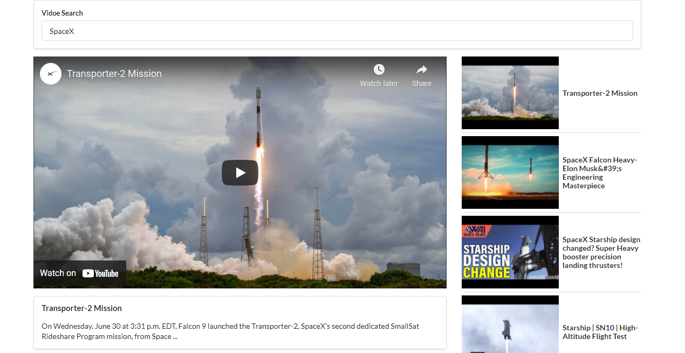

# Video Searching App using YouTube API

The application is split into seperate components: 

## SearchBar 
This component is going to have the user input in the search input, one callback funtion on the input onChange reads the value and another callback in the form onSubmit passes it to the App component where the actual API requrst happens.      

## VideoList
This component will have all the videos of the request. In the request we made the maxResults fixed to 10. So, 10 videos will be appeared. In this component we return another component VideoItem and in the props we pass a callback onVideoSelect. The origin of this callback is in App component, onVideoSelect simply update the state of selectedVideo.     

## VideoItem
VideoItem component gives the thumbnail of the video and also the title of the individual video. Used some CSS to make it on center and keep the size of the image of the thumbnail in a specific size. 

## VideoDetail
Finally, we have VideoDetail which is responsible for actually showing a video player using the iframe tag to play the fetched YouTube video and also the title and the description of the video.  

The App component is the parent component of all of these components which holds all of the states of the application, stores whatever the current search term is, retrieves the video list. The App component configures the other components by passing props from the App down to each of these components. 

